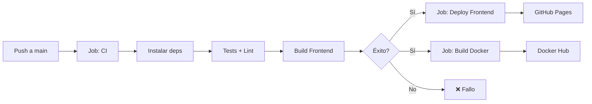

# 🚀 Pipeline CI/CD: Express + Vite + React

Implementación completa de un pipeline CI/CD con GitHub Actions para una aplicación full-stack.

## 📋 Estructura del Proyecto

```
mi-proyecto-ci-cd/
├── backend/                      # API REST con Express
│   ├── src/
│   │   └── index.js             # Servidor Express
│   ├── package.json
│   ├── Dockerfile               # Imagen Docker del backend
│   └── .dockerignore
├── frontend/                     # Interfaz con Vite + React
│   ├── src/
│   │   ├── App.jsx
│   │   ├── main.jsx
│   │   ├── App.css
│   │   └── index.css
│   ├── index.html
│   ├── vite.config.js
│   └── package.json
├── .github/
│   └── workflows/
│       └── ci-cd.yml            # Workflow de GitHub Actions
├── .gitignore
├── docker-compose.yml           # (Opcional) Para desarrollo local
└── README.md
```

## ✨ Características del Pipeline

### 1️⃣ **CI (Integración Continua)**
- ✅ Instalación automática de dependencias
- ✅ Ejecución de tests (frontend + backend)
- ✅ Ejecución de linters
- ✅ Build del frontend con Vite
- ✅ Generación de artefactos

### 2️⃣ **CD Frontend (Despliegue Automático)**
- 🌐 Despliegue automático a **GitHub Pages**
- 📦 Artefactos almacenados y reutilizados
- ⚡ Actualización en vivo con cada push a `main`

### 3️⃣ **CD Backend (Docker Hub)**
- 🐳 Construcción de imagen Docker
- 📤 Publicación en **Docker Hub**
- 🏷️ Tags automáticos (latest + versión)

## 🛠️ Requisitos Previos

- **Git**: Instalado y configurado
- **Node.js**: v18 o superior
- **Docker**: (Opcional, para pruebas locales)
- **GitHub**: Cuenta creada y repositorio creado
- **Docker Hub**: Cuenta creada (para el backend)

## 🚀 Pasos para Configurar

### 1. Inicializar Repositorio Git

```bash
cd mi-proyecto-ci-cd
git init
git add .
git commit -m "Proyecto Express + Vite con estructura para CI/CD"
git branch -M main
git remote add origin https://github.com/TU_USUARIO/mi-proyecto-ci-cd.git
git push -u origin main
```

### 2. Configurar Secretos en GitHub

Ve a: **Settings → Secrets and variables → Actions → New repository secret**

Crea los siguientes secretos:
- `DOCKERHUB_USERNAME`: Tu usuario de Docker Hub
- `DOCKERHUB_TOKEN`: Token de acceso de Docker Hub

**Cómo generar un token de Docker Hub:**
1. Inicia sesión en [hub.docker.com](https://hub.docker.com)
2. Ve a Account Settings → Security → New Access Token
3. Dale nombre al token (ej: `github-actions`)
4. Copia el token y guárdalo como secreto en GitHub

### 3. Configurar GitHub Pages (para el frontend)

1. Ve a **Settings → Pages**
2. En "Source", selecciona rama `gh-pages`
3. El sitio será publicado en: `https://TU_USUARIO.github.io/NOMBRE_REPO`

## 📝 Desarrollo Local

### Instalar dependencias

```bash
# Backend
cd backend
npm install

# Frontend
cd ../frontend
npm install
```

### Ejecutar en desarrollo

**Terminal 1 - Backend:**
```bash
cd backend
npm run dev
```

**Terminal 2 - Frontend:**
```bash
cd frontend
npm run dev
```

Abre [http://localhost:5173](http://localhost:5173) para ver el frontend.

### Ejecutar con Docker (Backend)

```bash
cd backend
docker build -t mi-backend:latest .
docker run -p 4000:4000 mi-backend:latest
```

## 🔄 Flujo del Pipeline



## 📊 Monitoreo del Pipeline

1. Ve al repositorio en GitHub
2. Haz clic en la pestaña **Actions**
3. Verás el workflow en ejecución
4. Cada job mostrará su estado:
   - ✅ Éxito
   - ❌ Error
   - ⏳ En progreso

## 🧪 Cómo Probar

### Cambiar algo y hacer push:

```bash
# Edita el archivo
nano backend/src/index.js  # Cambia el mensaje

# Commit y push
git add .
git commit -m "Cambio en el mensaje del backend"
git push
```

### Ver resultados:
1. Ve a **Actions** en GitHub
2. Verifica que todos los jobs pasaron
3. Abre tu GitHub Pages para ver el nuevo frontend
4. Comprueba en Docker Hub que la imagen fue subida

## 📦 Variables y Configuración

### Backend (Express)
- **Puerto**: `4000` (configurable con `PORT`)
- **Endpoints**:
  - `GET /api/saludo` - Mensaje simple
  - `GET /health` - Health check

### Frontend (Vite + React)
- **Puerto desarrollo**: `5173`
- **Build output**: `frontend/dist`
- **Base**: `./` (compatible con GitHub Pages)

## 🐛 Solución de Problemas

### El frontend no se conecta al backend en producción
- Actualiza la URL de la API en `frontend/src/App.jsx`
- Cambia `http://localhost:4000` por tu URL de producción

### Docker Hub: "unauthorized: incorrect username or password"
- Verifica que el token sea válido
- Recrea el secreto `DOCKERHUB_TOKEN` en GitHub

### GitHub Pages: "404 Not Found"
- Asegúrate que la rama `gh-pages` existe
- Verifica en Settings → Pages que la rama está seleccionada

## 📚 Referencias

- [GitHub Actions](https://docs.github.com/es/actions)
- [Express.js](https://expressjs.com/)
- [Vite](https://vitejs.dev/)
- [React](https://react.dev/)
- [Docker](https://www.docker.com/)
- [GitHub Pages](https://pages.github.com/)

## 🤝 Contribuir

1. Crea un branch: `git checkout -b feature/nueva-feature`
2. Haz commit: `git commit -am "Agrega nueva feature"`
3. Push: `git push origin feature/nueva-feature`
4. Abre un Pull Request

## 📄 Licencia

MIT License - Libre para usar y modificar.

---

**¡Listo para usar! 🎉**

Con este pipeline, cada push a `main` disparará automáticamente:
- Tests y builds
- Despliegue del frontend a GitHub Pages
- Construcción y publicación de la imagen Docker del backend
